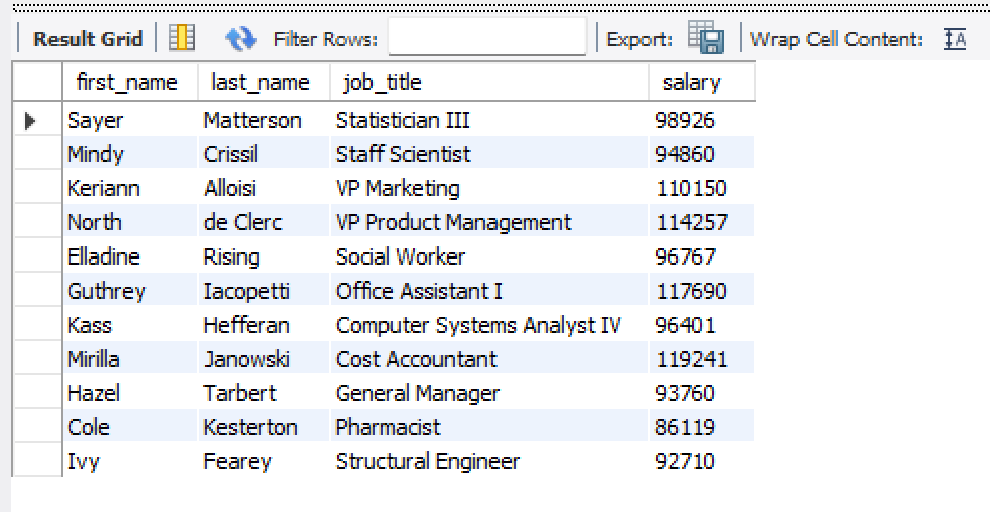

# Creating a SQL database and executing queries to analyze data and generate reports.

Using MySQL, I created a database for an e-commerce company that stores inventory data, invoicing data, as well as customer and orders data, along with employee information. After creating the database, I was able to query the data to analyze it and create reports. I utilized functions and clauses such as 
    SELECT,
    FROM,
    INNER JOIN,
    OUTER JOIN,
    USING,
    WHERE,
    GROUP BY,
    WITH ROLLUP,
    HAVING,
    ORDER BY,
    EXISTS,
    ANY,
    IN, and
    Subqueries.

# Analysis
## Aggregate function using union

* Create a report that summarizes total sales and payments for both halves of the year, including the remaining balance due.

    ## Query
    
    
    ## Output
    

## Group By & Order By Clause

* Create a report that summarizes the total payments  for each day as well as the payment method

    ## Query
    
    ## Output
    

## Inner Join
* Create a report of all the items that have been ordered along with the product name, unit price quatity, order_id, and product_id.

    ## Query
    

    ## Output
    

## Outer Join Multiple Tables
* Create a report of all orders placed by each client along with the order status

    ## Query
    

    ## Output
    

## The USING clause

* create a report of all payments mmade by each client along with the payment date and payment type

    ## Query 
    

    ## Output
    

## Having

* Create a report of all customers located in Virginia who have spent more than $100

    ## Query 
    

    ## Output
    

## Sub queries

* Create a report of all products that are more expensive than Lettuce(id = 3)
    ## Query
    

    ## Output
    

* In the sql_hr database: find emplyees who earn more than average 

    ## Query
    

    ## Output
    

* Create a report of all the products that have never been ordered

 ## Query
 

 ## Output
 

* Create a report of all the clients without invoices 

    ## Query
    

    ## Output
    

* Create a report of all customers who have ordered lettuce (id = 3) using subquery

    ## Query
    

    ## Output
    

* Create a report of invoices larger than all invoices of client 3 using the Max and ALL function 

    ## Query: Max
    

    ## Query: ALL
    

    ## Output
    

* Create a report of all clients with at least two invoices using the ANY and IN operator

    ## Query
    

    ## Output
    

## Correlated Subqueries

* Create a report of all employees whose salary is above the average in their office

    ## Query
    

    ## Output
    

* Create a report of all the invoices that are larger than the client's average invoice amount

    ## Query
    

    ## Output
    

* Create a report all the clients that have an invoice

    ## Query
    

    ## Output
    

* Create a report of all the clients that have an invoice using the exist operator

* Create a report of all the products that have never been ordered 
