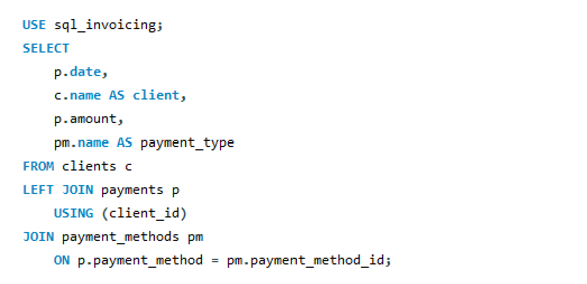
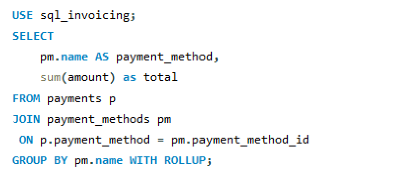
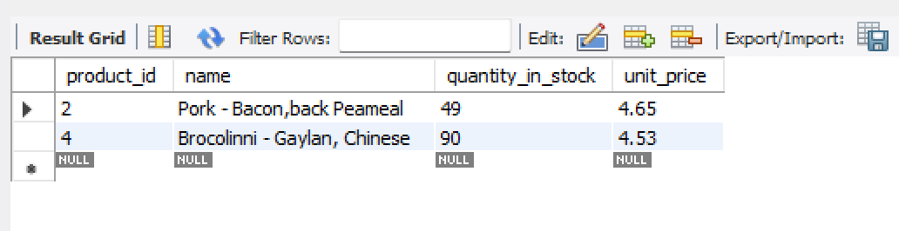
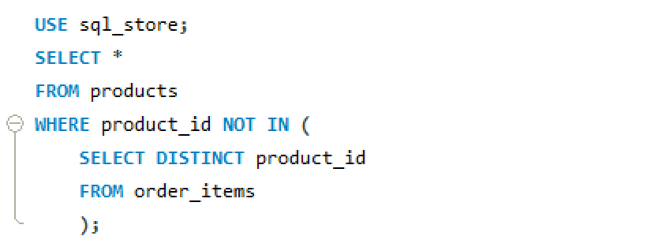
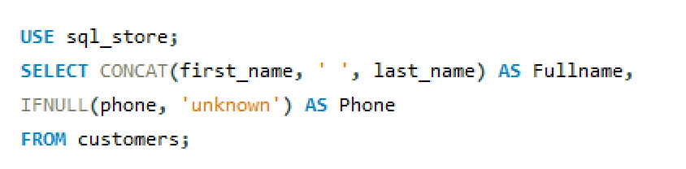

# Creating a SQL database and executing queries to analyze data and generate reports.

I created a MySQL database for an e-commerce company that stores various types of data, including inventory information, invoicing details, customer records, order data, and employee information. After establishing the database, I performed queries to analyze the data and generate reports. 
I utilized several functions and clauses, such as SELECT, FROM, INNER JOIN, OUTER JOIN, USING, WHERE, GROUP BY, WITH ROLLUP, HAVING, ORDER BY, CASE, EXISTS, ANY, IN, Subqueries, and Views.

# Analysis
## Aggregate function using union

* Create a report summarizing total sales and payments for each half of the year, along with the remaining balance owed.

    ## Query
    
    
    ## Output
    

## Group By & Order By Clause

* Create a report summarizing total daily payments and payment methods.

    ## Query
    
    ## Output
    

## Inner Join
* Create a report of all the ordered items, including the product name, unit price, quantity, order ID, and product ID.

    ## Query
    

    ## Output
    

## Outer Join Multiple Tables
* Create a report detailing all orders placed by each client, along with their respective order statuses.

    ## Query
    

    ## Output
    

## The USING Clause

* Create a report of all payments made by each client, along with the payment date and payment type.

    ## Query 
    

    ## Output
    

## The Having Clause

* Create a report of all customers in Virginia who spent over $100.

    ## Query 
    

    ## Output
    

## The Roll Up Operator

* Create a report that summarizes the total payments made for each payment method.

    ## Query
    

    ## Output
    

## The Case Operator

* Generate a report of all customers and categorize them based on their points. Customers with more than 3000 points should be labeled as "Gold." Those with points ranging from 2000 to 3000 should be labeled as "Silver," and customers with fewer than 2000 points should be labeled as "Bronze."
    
    ## Query
    

    ## Output
    

## Subqueries

* Please generate a report listing all products that have a higher price than Lettuce (ID = 3).

    ## Query
    

    ## Output
    
    

* In the sql_hr database, identify the employees whose salaries are higher than the average salary.

    ## Query
    

    ## Output
    

* Prepare a report listing all the products that have never been ordered.

 ## Query
 

 ## Output
 

* Generate a report listing all clients who do not have an invoice.

    ## Query
    

    ## Output
    

* Create a report of all customers who ordered lettuce (id = 3) using a subquery.

    ## Query
    

    ## Output
    

* Create a report for invoices exceeding all invoices from client 3 using the MAX and ALL functions.

    ## Query: Max
    

    ## Query: ALL
    

    ## Output
    

* Create a report of clients with at least two invoices using the ANY and IN operators.

    ## Query
    

    ## Output
    

## Correlated Subqueries

* Create a report of employees earning above their office average salary.

    ## Query
    

    ## Output
    

* Create a report for invoices exceeding the client's average amount.

    ## Query
    

    ## Output
    

* Create a report all the clients that have an invoice.

    ## Query
    

    ## Output
    

* Create a report of all clients with an invoice using the exist operator.

    ## Query
    

    ## Output
    

* Create a report detailing the total sales and average sales for each client.

    ## Query
    

    ## Output
    

* Generate a report for all orders that have been placed this year.

    ## Query
    

* Extract the date of the most recent order.
 
    ## Query
    

    ## Output
    

* Create a report of all customers with their phone numbers. Combine first name and last name into one column. If customers don't have a phone number, assign 'unknown' to them.
    
    ## Query
    

    ## Output
    

* Create a report of all orders. Label orders as active if they were placed in the current year; otherwise, label them as archived.

    ## Query
    

    ## Output
    

* Create a report of all products along with the number of times they have been ordered and their frequency. If they have been ordered more than once, label the frequency as 'many times'.
    
    ## Query
    

    ## Output
    

## Creating Views

* Create a view displaying each client and their total balance owed.

    ## Query
    

    ## Output
    